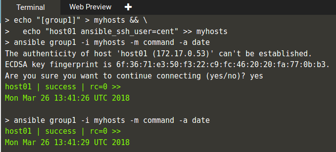

# Ansible
Ansible adalah sebuah perangkat lunak komputer atau software yang dapat membantu seorang devops atau sistem administrator untuk melakukan otomasi di servernya. Ansible dapat membantu melakukan instalasi, deployment, bahkan mengupdate server.

**konfigurasi CentOS dengan Ansible**
****
